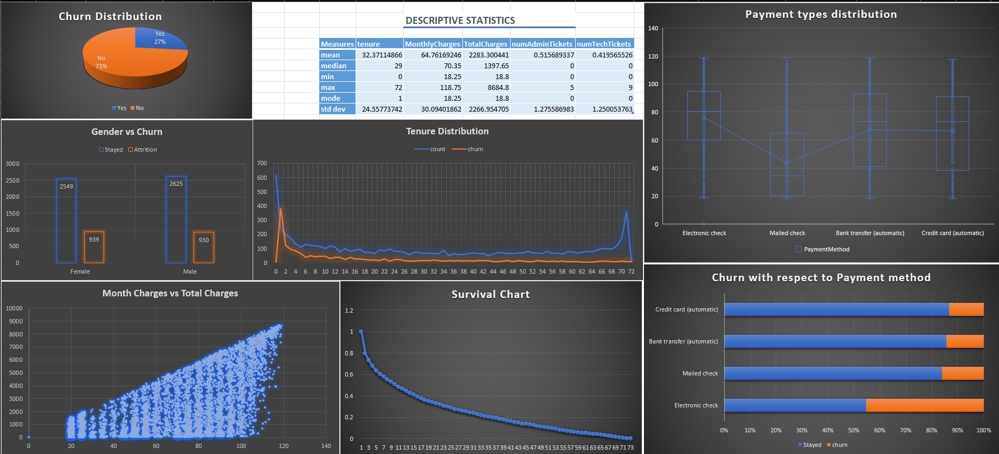

# Telecom Churn Rate Analysis Dashboard

This repository contains an analysis of the telecom churn rate dataset along with visualizations created using Excel. The analysis includes various Excel functions such as VLOOKUP, HLOOKUP, XLOOKUP, pivot tables, pivot charts, and dashboard visualizations.

## Dashboard Preview

## Dataset Overview

The dataset used for this analysis includes information about telecom customers, including their gender, tenure, payment method, monthly charges, total charges, and churn status.

## Analysis Highlights

1. **Churn Distribution Pie Chart**: Visual representation of the distribution of churned and non-churned customers by gender.

2. **Tenure Distribution**: A histogram showcasing the distribution of total customer count and churned customers across different tenure ranges (0-72 years of service).

3. **Cox-Box Graph**: Box plot showing the distribution of customers in groups divided by payment method.

4. **Survival Line Chart**: A line chart illustrating the survival probability of customers over the years.

5. **Monthly Charges vs. Total Charges**: Scatter plot comparing monthly charges and total charges.

6. **Churn Rate by Payment Method**: Bar chart showing the churn rate with respect to payment method.

7. **Descriptive Statistics Table**: A table providing descriptive statistics including mean, median, min, max, mode, and standard deviation.

## Usage
To reproduce the analysis and visualizations, follow these steps:

1. Download the telecom churn rate dataset.
2. Open the Excel file provided.
3. Navigate to the various sheets and tabs to view the VLOOKUP, HLOOKUP, XLOOKUP, pivot tables, pivot charts, and the dashboard visualizations.

## Dependencies
No additional dependencies are required to view the Excel analysis. Ensure you have Microsoft Excel or a compatible spreadsheet software installed.
